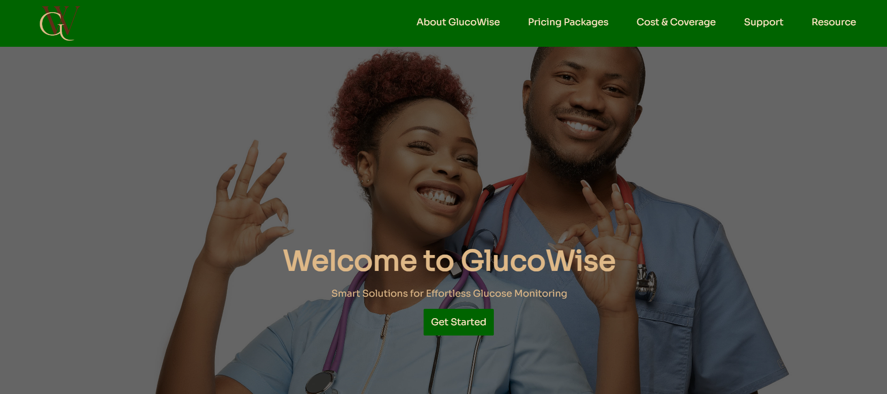

# GlucoWise - Web App
A Web Application that serves as a comprehensive platform with curated information about a conceptual medical institution - [PAX] Private Psychiatry & Therapy Clinic. It aims to create a safe space where users can access the clinic's services right from the comfort of their home while offering registered users access to a private dashboard to conveniently schedule appointments, securely communicate with therapists, and access personalized resources designed to support their mental health journey.  

## Technologies
* React.js
* CSS
* Material UI
* AntD
* Sweet Alert
* Recharts
* Firebase
* VSCode

## Getting Started
To view the website, click on the link here: https://glucowise-fd1e6.web.app/ .

To run in development mode:
1. Install *node.js* >=18,
2. Install *git* & *Clone* this Repository,
3. Install Project Dependencies >>> *npm install*,
4. Start Development Server >>> *npm start*,
5. View website at http://localhost:3000 where corresponding changes to code will be displayed;

## Usage Instructions
View Project folder & navigate to */src/components* to find all Front-End inputs.

Be aware that website uses Firebase Backend component setup (Authentication + Firestore + Hosting) with Front-End Development as the primary focus.

## Attribution
Yet again, much respect to Freepik that offers a diverse range of assets. A few high-quality images which have enhanced the visual quality of the website were sourced from freepik, find below a mention of the sources:

* Asset: 'Hero Section' | source: https://bit.ly/3RQlosz
* Asset: 'About Section' | source: https://bit.ly/3GQ6axo
* Asset: 'Insurance Section' | source: https://bit.ly/3tqnS7Q

Please be sure to credit the work of these artists & contributors for your own projects. 

## Contributions
Feel free to fork this repo and make your own changes, there are definitely enhacements to be made. Just make sure to give due credit by linking to Speck249 ;)

Thanks for stopping by!